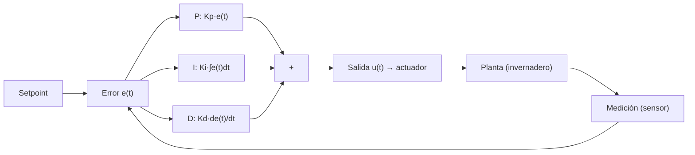
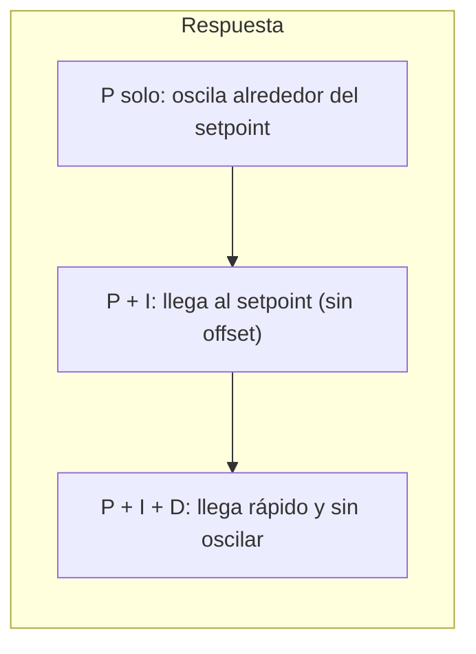

# Control PID

> **Tipo:** Concepto | **Estado:** Estable | **Fecha:** 2026-10-02

Explicación de los controladores **PID** (Proporcional-Integral-Derivativo) y su
aplicación en el invernadero.

## 1. ¿Qué es un PID?

Un controlador PID ajusta una **salida** (p. ej., potencia de un ventilador) para
llevar una **variable medida** (temperatura) al **objetivo** (setpoint), minimizando
el error:

```text
error = setpoint − medición
```

## 2. Diagrama de bloques



## 3. Los tres términos

| Término | Acción | Efecto de aumentar el coeficiente |
|---------|--------|-----------------------------------|
| **P** (proporcional) | corrige según el error **actual** | respuesta más rápida, pero tiende a oscilar |
| **I** (integral) | acumula el error en el tiempo | elimina el **error estacionario**, puede sobreoscilar |
| **D** (derivativo) | reacciona a la **tendencia** | amortigua oscilaciones, pero amplifica el ruido |

## 4. Fórmula

```text
u(t) = Kp·e(t) + Ki·∫e(t) dt + Kd·de(t)/dt
```

## 5. Respuesta típica



## 6. Sintonización

1. **Manual**: empezar solo con `Kp`, subir hasta que oscile; bajar a la mitad.
   Luego subir `Ki` hasta eliminar el offset; por último `Kd` para amortiguar.
2. **Ziegler-Nichols**: llevar el lazo a oscilación sostenida (solo `Kp`), medir el
   periodo `Tu`, y derivar `Kp/Ki/Kd` de tablas.

## 7. Aplicación en el invernadero

| Lazo | Variable | Salida | Notas |
|------|----------|--------|-------|
| Clima | Temperatura | Ventilación/calefacción | PID o histéresis (según inercia) |
| Clima | Humedad | Humidificador/extractor | PID o histéresis |
| Riego | Humedad de suelo | Válvula/bomba | normalmente histéresis (suelo lento) |
| Ventilación | CO₂ | Extractor | PID si se mide CO₂ |

> En sistemas con mucha inercia (suelo, temperatura ambiente) la **histéresis**
> suele ser más robusta y simple que un PID; el PID brilla en lazos rápidos o con
> offset por eliminar.
