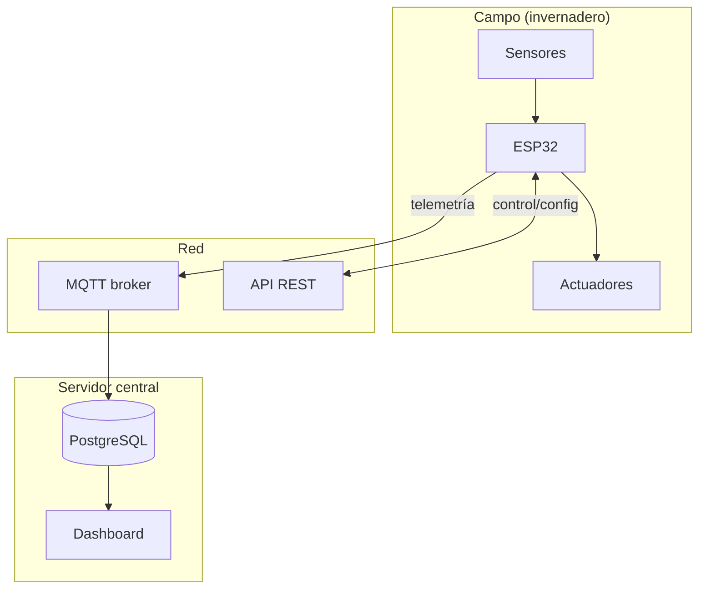
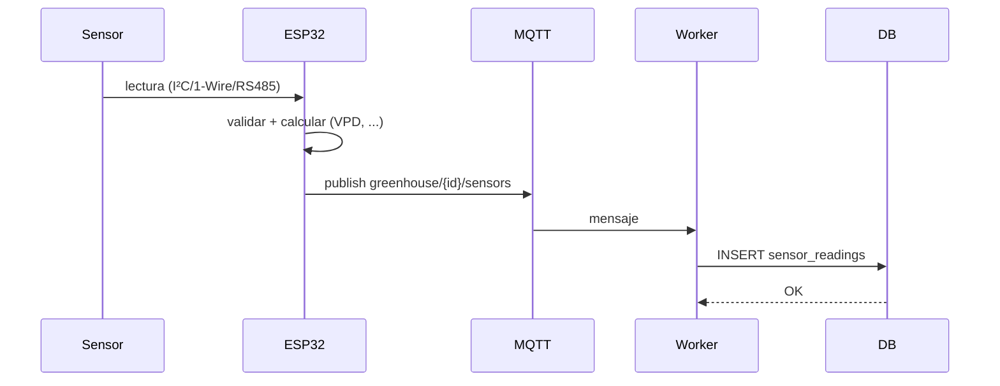
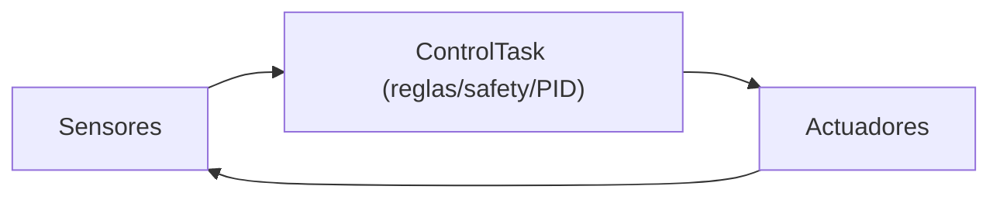
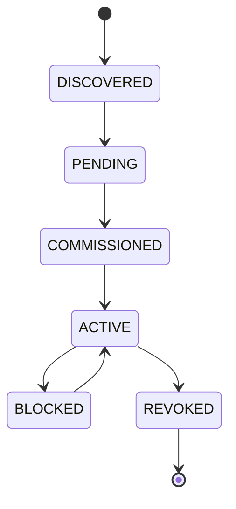
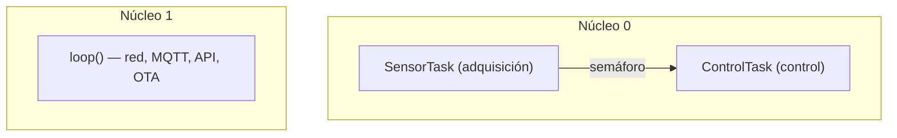

# Diagramas de bloques y flujo de datos

> **Tipo:** Referencia | **Estado:** Estable | **Fecha:** 2026-10-02

Diagramas que explican cómo fluyen los datos y cómo se estructura el sistema.

## 1. Arquitectura del sistema

## 2. Flujo de datos (telemetría)

## 3. Lazo de control local (sin servidor)

## 4. Ciclo de vida de un dispositivo

## 5. Tareas FreeRTOS

