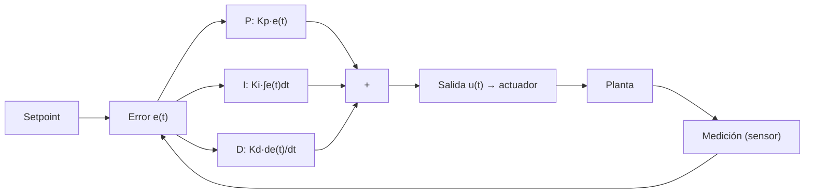

---
tags:
  - sema
  - control
---

# Control PID (concepto y estado futuro)

> **Tipo:** Concepto | **Estado:** Futuro | **Fecha:** 2026-10-08 | **Firmware:** v1.103.0

Explicación de los controladores **PID** (Proporcional-Integral-Derivativo) y su
aplicación **prevista** en SEMA. **Importante: el PID no está implementado** en
`v1.103.0`; esta página existe para documentar la idea, el motivo por el que hoy se
usan umbrales y cómo se implementaría.

## 1. ¿Qué es un PID?

Un controlador PID ajusta una **salida** (potencia de un ventilador, apertura de una
válvula) para llevar una **variable medida** (temperatura, humedad) a un **objetivo**
(setpoint), partiendo del error:

```text
error = setpoint − medición
```



## 2. Los tres términos

| Término | Acción | Efecto al subir el coeficiente |
|---------|--------|--------------------------------|
| **P** (proporcional) | corrige según el error actual | respuesta más rápida, tiende a oscilar |
| **I** (integral) | acumula el error en el tiempo | elimina el error en régimen permanente, puede sobreoscilatar |
| **D** (derivativo) | reacciona a la tendencia del error | amortigua, amplifica el ruido de medición |

```text
u(t) = Kp·e(t) + Ki·∫e(t) dt + Kd·de(t)/dt
```

## 3. Estado actual en SEMA: umbrales, no PID

Lo que **sí** existe hoy es el `RuleEngine` (`include/core/alarms/Rule.hpp`,
`src/core/alarms/RuleEngine.cpp`), que compara un canal contra un umbral:

| Aspecto | Comportamiento real en v1.103.0 |
|---------|----------------------------------|
| Campos de una regla | `name`, `sensor_id` (`""` = cualquier sensor), `channel_id`, `op`, `value` |
| Operadores | `gt` (`>`), `lt` (`<`), `ge` (`>=`), `le` (`<=`); un nombre desconocido cae en `gt` |
| Evento generado | `EventType::Alarm` con severidad **`Warning` fija** (`e.value = valor × 100`, `correlationId = id` de la regla) |
| Persistencia | `EventLog` en LittleFS (últimas 100 entradas por defecto) |
| Histéresis | **No implementada**: no hay umbral dual ni temporización. Se puede emular con dos reglas y lógica externa |
| Acción sobre salidas | **No**: el motor solo publica el evento; no escribe GPIO ni PWM |
| Ajuste automático | **No**: no hay lazo cerrado (sin setpoint ni realimentación) |

Es decir: hoy SEMA **detecta y notifica**, no controla. Ver
[Alarmas y reglas](Alarmas-y-reglas.md) y [Actuadores y salidas](Actuadores-y-Salidas.md).

## 4. Qué se usa hoy en la práctica (lazo abierto)

1. Una [regla](Alarmas-y-reglas.md) vigila el canal (por ejemplo `temperature > 40`).
2. Al superarse el umbral se emite un evento de alarma y se persiste en el `EventLog`.
3. El evento se publica (MQTT/webhook) o se consulta por `GET /api/v1/alarms`.
4. **Alguien externo** (un script, Node-RED, Home Assistant o el Servidor Central)
   decide y escribe la salida con `POST /api/v1/gpio` o `POST /api/v1/shift`.

Ese "alguien externo" es hoy el que aporta la histéresis o el lazo cerrado.

## 5. Umbral vs PID: cuándo conviene cada uno

| Lazo | Variable | Salida | Control recomendado |
|------|----------|--------|---------------------|
| Ventilación | Temperatura | Ventilador | Histéresis (inercia alta, evita ciclado) |
| Riego | Humedad de suelo | Válvula/bomba | Histéresis + límite de tiempo |
| Calefacción | Temperatura | Calefactor | Histéresis; PID si se busca precisión |
| CO₂ en invernadero | CO₂ (SCD30) | Extractor | PID (lazo razonablemente rápido) |
| Humedad en cámara | Humedad relativa | Humidificador | PID con anti-windup |

> En sistemas con mucha inercia (suelo, temperatura ambiente) la **histéresis** suele
> ser más robusta que un PID; el PID aporta cuando hace falta eliminar *offset* o
> seguir un setpoint variable.

## 6. Cómo se implementaría (propuesta, no implementado)

Diseño tentativo para una versión futura:

```json
{
  "pid": [
    {
      "id": "co2_extractor",
      "sensor_id": "CO2",
      "channel_id": "co2",
      "setpoint": 800,
      "kp": 0.5, "ki": 0.05, "kd": 0.0,
      "output": { "gpio": 26, "type": "pwm", "min": 0, "max": 255 },
      "period_s": 10,
      "anti_windup": 100,
      "hysteresis": 20
    }
  ]
}
```

Requisitos técnicos a resolver antes de implementarlo:

- **Tarea periódica** propia en el `Scheduler` (no en el lazo de adquisición).
- **Salida PWM real**: hoy la salida PWM por GPIO/expansor es una capacidad por
  confirmar; en 74HC595 requiere *soft-PWM* asistida (ver `README.md` §29).
- **Seguridad**: límites de salida, tiempo máximo encendido, modo degradado si el
  sensor queda offline (`quality != VALID`) y siempre apagar ante fallo.
- **Persistencia**: la config debe ser validada por `ConfigManager` (nueva sección y
  bump de `SEMA_CONFIG_SCHEMA_VERSION`).
- **Trazabilidad**: registrar setpoint, error y salida en el `EventLog`.

Nada de esto existe todavía; se documenta para que la implementación futura respete el
principio de "configuración, no firmware".

---

## Ver también

- [Alarmas y reglas](Alarmas-y-reglas.md) · [Actuadores y salidas](Actuadores-y-Salidas.md) · [Futuro](Futuro.md)
- [Magnitudes derivadas](Magnitudes-derivadas.md) · [Referencia de configuración](Referencia-configuracion.md)
