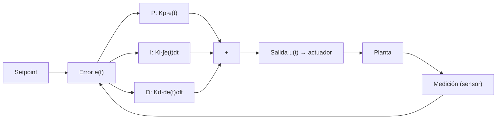

---
tags:
  - sema
  - control
---

# Control PID

> **Tipo:** Concepto | **Estado:** Futuro | **Firmware:** v1.43.0

Explicación de los controladores **PID** (Proporcional-Integral-Derivativo) y su
aplicación prevista en SEMA para regular actuadores.

## ¿Qué es un PID?

Un controlador PID ajusta una **salida** (potencia de un ventilador, apertura de una
válvula) para llevar una **variable medida** (temperatura, humedad) al **objetivo**
(setpoint):

```text
error = setpoint − medición
```



## Los tres términos

| Término | Acción | Efecto de subir el coeficiente |
|---------|--------|--------------------------------|
| **P** (proporcional) | corrige según el error actual | más rápido, tiende a oscilar |
| **I** (integral) | acumula el error en el tiempo | elimina el offset, puede sobreoscilar |
| **D** (derivativo) | reacciona a la tendencia | amortigua, amplifica el ruido |

## Fórmula

```text
u(t) = Kp·e(t) + Ki·∫e(t) dt + Kd·de(t)/dt
```

## Estado actual en SEMA

Hoy SEMA controla por **umbrales** (reglas `gt`/`lt`/`ge`/`le` del `RuleEngine`) y
**histéresis** (encender/apagar a dos umbrales distintos). El PID está previsto como
mejora futura para lazos rápidos.

| Lazo | Variable | Salida | Control recomendado |
|------|----------|--------|---------------------|
| Ventilación | Temperatura | Ventilador | histéresis (inercia alta) |
| Riego | Humedad de suelo | Válvula/bomba | histéresis |
| Calefacción | Temperatura | Calefactor | PID o histéresis |
| CO₂ | Concentración | Extractor | PID (si se mide CO₂) |

> En sistemas con mucha inercia (suelo, temperatura ambiente) la **histéresis** es
> más robusta que un PID; el PID brilla en lazos rápidos o con offset por eliminar.

## Cómo se combina hoy (reglas + actuador)

1. Una [regla](Referencia-configuracion.md#rules) vigila el canal
   (p. ej. `temperature > 40`).
2. Al superar el umbral se emite un **evento `alarm`**.
3. Un módulo o el Servidor Central escribe `POST /api/v1/gpio` para actuar sobre la
   salida (relé/ventilador).
