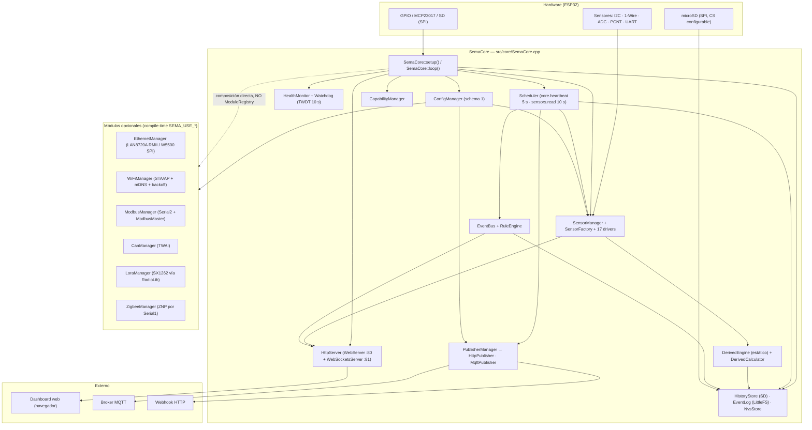
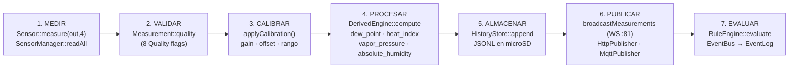
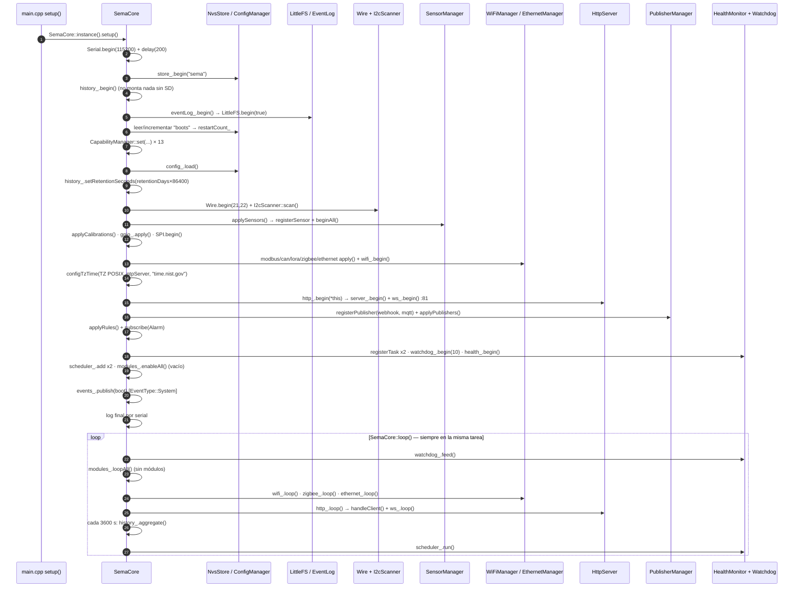
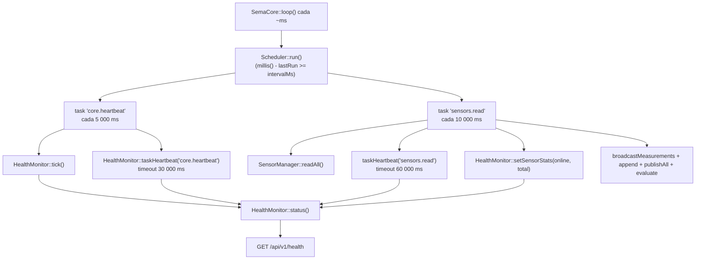
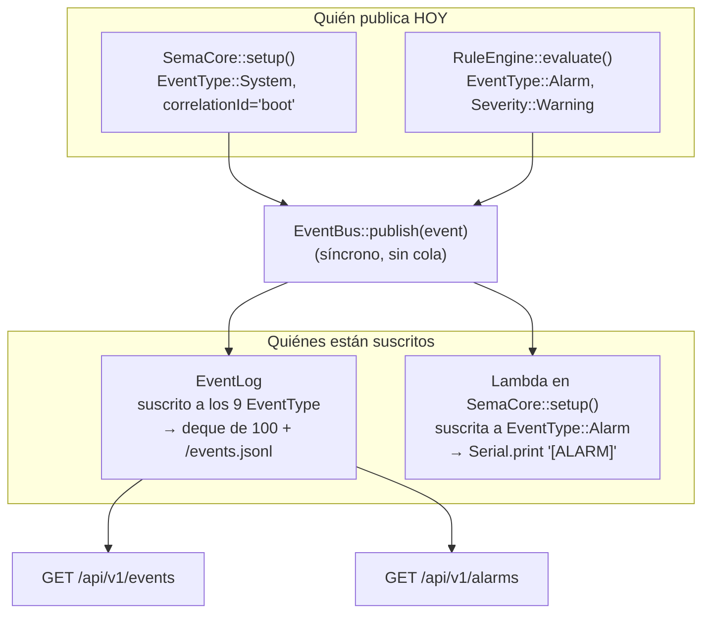
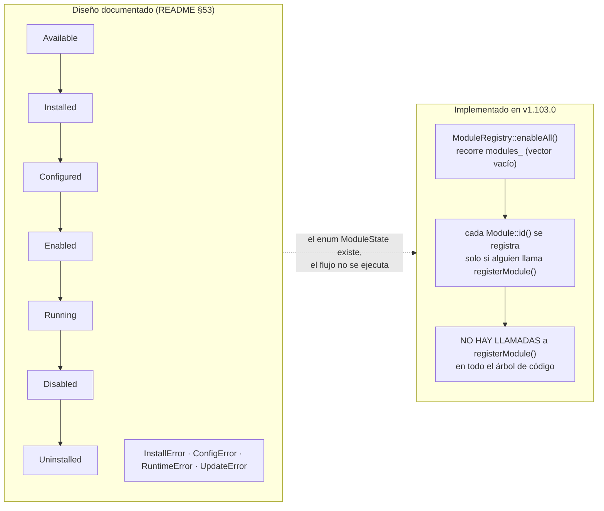
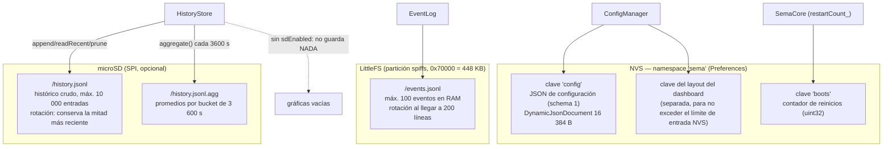
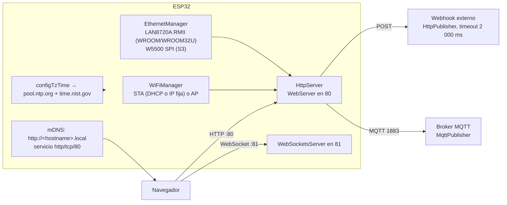

---
tags:
  - sema
  - diagramas
---

# Diagramas

> **Tipo:** Concepto | **Estado:** Estable | **Fecha:** 2026-10-08 | **Firmware:** v1.103.0

Diagramas de la implementación **real** de SEMA. Todos los nodos usan los nombres
de clase, archivo o clave que existen en el código de v1.103.0; no hay nodos
inventados. Donde el diseño aspiracional difiere de lo implementado, se indica.

## 1. Arquitectura de alto nivel

Lectura del diagrama: la flecha punteada final recuerda que los managers
opcionales son **miembros de `SemaCore`**, no módulos registrados. El
`ModuleRegistry` queda vacío en runtime (ver §6).

## 2. Pipeline de datos (ciclo de 10 s)

Nombres reales: `SensorManager::readAll()`, `applyCalibration()`,
`DerivedEngine::compute()`, `HistoryStore::append()`,
`HttpServer::broadcastMeasurements()`, `PublisherManager::publishAll()`,
`RuleEngine::evaluate()`.

Detalles verificados que el diagrama no muestra:

- Los pasos 5, 6 y 7 se ejecutan **por cada medición** en un bucle, salvo el
  broadcast WS, que se hace una vez con el vector completo.
- El paso 2 es informativo: ninguna etapa descarta mediciones por `quality`.
- El paso 3 solo actúa si hay una `Calibration` cuya clave sea exactamente
  `sensorId + ":" + channelId`.
- El paso 7 publica un `Event` con `type = EventType::Alarm`,
  `severity = Severity::Warning`, `value = (int32_t)(valor * 100)` y
  `correlationId = id de la regla`.

## 3. Ciclo de arranque (setup → loop)

## 4. Scheduler y latidos

El intervalo del `Scheduler` se compara con `millis()` en cada vuelta del `loop()`,
así que la precisión depende de cuánto tarde el resto del `loop()`. No hay
temporizadores por hardware ni tareas FreeRTOS propias.

## 5. Bus de eventos (estado real)

`EventBus::publish()` recorre sus suscripciones e invoca el handler **en forma
síncrona**, en la misma tarea que publica. No hay cola ni buffer intermedio.

⚠️ De los 9 tipos de `EventType` (`Sensor, Rain, Lightning, Battery, Network,
Alarm, System, Wake, Sleep`), **solo dos se emiten**: `System` (el boot) y `Alarm`
(reglas). No hay emisores de `Sensor`, `Rain`, `Lightning`, `Battery`, `Network`,
`Wake` ni `Sleep` en el firmware; por eso el diagrama conceptual de versiones
anteriores ("RAIN_START → Storage, Alarm, MQTT, Webhook, Dashboard, Wake Manager")
no se corresponde con el código. El campo `Event::id` se inicializa en 0 y nunca se
incrementa.

## 6. Módulos: lo documentado vs. lo implementado

Los servicios reales no usan ese flujo: se aplican con `apply(cfg)` al arrancar y
con los `SemaCore::applyX()` en caliente. Ver
[Modulos-y-ciclo-de-vida](Modulos-y-ciclo-de-vida.md).

## 7. Almacenamiento

Nota: la configuración declara `storage.backend` con los valores válidos
`"littlefs" | "flash" | "sd"` (`ConfigManager::validate()`), pero el histórico se
escribe **siempre** en SD a través de `HistoryStore`; el campo `backend` no cambia
el destino del histórico.

## 8. Red y servicios expuestos

---

## Ver también

- [Arquitectura](Arquitectura.md) · [Modulos-y-ciclo-de-vida](Modulos-y-ciclo-de-vida.md)
- [Tareas-y-concurrencia](Tareas-y-concurrencia.md) · [Rendimiento-y-memoria](Rendimiento-y-memoria.md)
- [Diagnostico-y-salud](Diagnostico-y-salud.md) · [Almacenamiento-e-historico](Almacenamiento-e-historico.md)
- [MQTT-y-WebSocket](MQTT-y-WebSocket.md) · [API-REST](API-REST.md)
