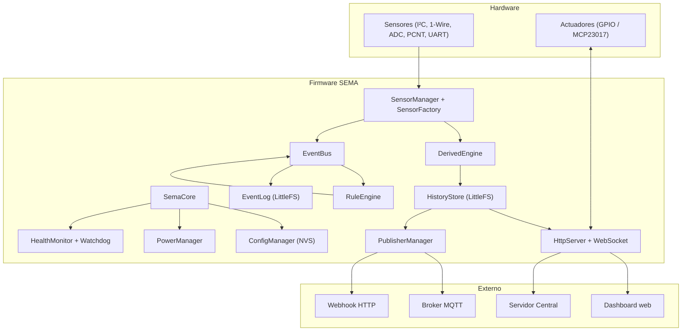
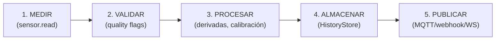
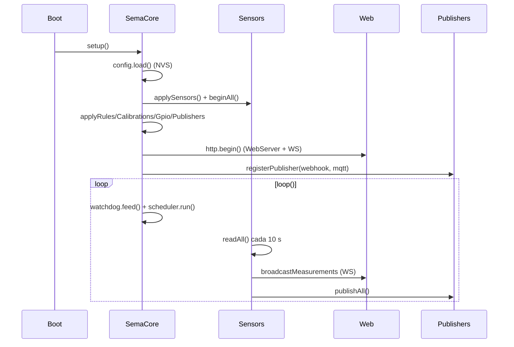
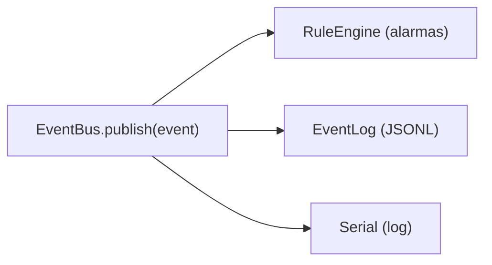
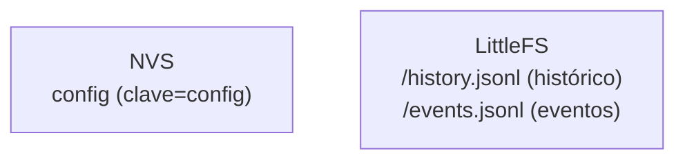

---
tags:
  - sema
  - diagramas
---

# Diagramas de bloques y flujo de datos

> **Tipo:** Concepto | **Estado:** Estable | **Firmware:** v1.78.0

## Arquitectura de alto nivel

## Flujo de datos (pipeline)

## Ciclo de vida (setup → loop)

## Eventos

## Almacenamiento

