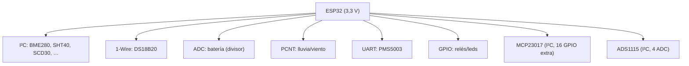

---
tags:
  - sema
  - hardware
---

# Hardware y conexiones

> **Tipo:** Referencia | **Estado:** Estable | **Firmware:** v1.23.0

Conexiones sugeridas entre el ESP32 y los sensores/actuadores.

## Alimentación

```text
ESP32 VIN  ← 5 V (o 3,3 V en 3V3)
ESP32 GND  ← GND común
```

- El ESP32 funciona a **3,3 V**; los sensores I²C de 3,3 V se alimentan desde `3V3`.
- Para sensores de 5 V, usar conversor de nivel lógico (bidireccional) en SDA/SCL.

## Bus I²C

```text
ESP32 3V3 ──┬── VCC (sensor)
            ├──[4,7 kΩ]── SDA (21)
            ├──[4,7 kΩ]── SCL (22)
ESP32 GND ──┴── GND (sensor)
```

- Pull-ups de **4,7 kΩ** a 3,3 V en SDA y SCL.
- Todos los sensores I²C comparten SDA/SCL y se distinguen por dirección.

## Bus 1-Wire (DS18B20)

```text
ESP32 GPIO4 ──┬── DATA (DS18B20)
              ├──[4,7 kΩ]── 3V3
ESP32 3V3 ────┼── VDD (DS18B20)
ESP32 GND ────┴── GND (DS18B20)
```

- Pull-up de **4,7 kΩ** entre DATA y 3V3 (obligatorio).
- Varios DS18B20 en paralelo sobre el mismo bus.

## Batería (divisor resistivo)

```text
V_bat (12 V) ──[R1 100 kΩ]──┬──[R2 10 kΩ]── GND
                            │
                            └── GPIO34 (ADC)
```

- Divisor 11:1 → `scale = 3.3 * 11.0 / 4095.0` (≈ 0,00887 V/bit).

## Pluviómetro / anemómetro (PCNT)

```text
Reed switch / hall ── GPIO (PCNT) ── GND
```

- Un contacto por pulso; `PCNT` cuenta los pulsos y `scale` los convierte a mm.

## Relé (salida)

```text
GPIO (p. ej. 26) ──[IN del módulo de relé]
Módulo de relé VCC ── 5V (fuente externa)
Módulo de relé GND ── GND común
```

- Usar **módulo de relé** (con transistor + optoacoplador); nunca conectar la bobina
  directa al GPIO.

## UART (PMS5003)

```text
PMS5003 TX ── RX2 (GPIO16)
PMS5003 RX ── TX2 (GPIO17)
PMS5003 VCC ── 5V
PMS5003 GND ── GND
```

## RS485 (TD501D485H, aislado)

El **TD501D485H** es un transceiver RS485 con **aislamiento galvánico** entre el
lado lógico y la línea: protege el ESP32 contra descargas/transitorios del bus.
Es compatible con el driver Modbus (control `DE`/`RE`).

```text
ESP32 TX  (GPIO17) ── DI  (TXD)
ESP32 RX  (GPIO16) ── RO  (RXD)
ESP32 GPIO(de_re) ──── DE + RE  (juntos, half-duplex)
TD501D485H A ──────── A+ (bus RS485)
TD501D485H B ──────── B- (bus RS485)
TD501D485H VCC ────── 3,3 V
TD501D485H GND ────── GND
```

- Usar la versión **3,3 V** para conectar directo al ESP32.
- Config `modbus.de_re` = GPIO de `DE`/`RE`; si el módulo auto-direcciona, usar `0`.

## CAN (TWAI)

Transceiver de la familia **SN65HVD23X** (3,3 V, compatible directo con el ESP32).

```text
ESP32 TX (GPIO5) ── TXD (SN65HVD23X)
ESP32 RX (GPIO4) ── RXD (SN65HVD23X)
CANH / CANL ──────── bus CAN (terminación 120 Ω en los extremos)
```

- `SN65HVD230` = con slope-control; `SN65HVD231`/`SN65HVD232` = modos de bajo consumo;
  `SN65HVD233`/`SN65HVD234` = sin slope-control + protección extendida.

## LoRa (SX1262PATR8-GC)

```text
ESP32 GPIO5  ── NSS  (CS)
ESP32 GPIO18 ── SCK  (VSPI)
ESP32 GPIO23 ── MOSI (VSPI)
ESP32 GPIO19 ── MISO (VSPI)
ESP32 GPIO14 ── NRST
ESP32 GPIO26 ── DIO1
ESP32 GPIO27 ── BUSY
```

## Zigbee (RF-BM-2652P2 / CC2652P2)

```text
ESP32 TX (GPIO17) ── RX del CC2652P2
ESP32 RX (GPIO16) ── TX del CC2652P2
CC2652P2 GND ─────── GND
CC2652P2 VCC ─────── 3,3 V
```

- El CC2652P2 debe cargar firmware **ZNP** (Zigbee Network Processor).
- Usar pines UART distintos a los de Modbus (Serial2) si ambos están habilitados.

## Diagrama general


