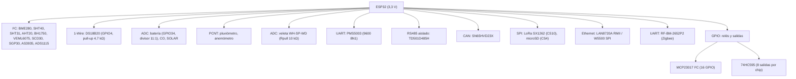

---
tags:
  - sema
  - hardware
  - conexiones
---

# Hardware y conexiones

> **Tipo:** Referencia | **Estado:** Estable | **Fecha:** 2026-10-08 | **Firmware:** v1.103.0

Ficha de conexión de **cada componente** que el firmware sabe manejar: interfaz,
tensión, resistencias, capacitores, cableado pin a pin y notas. Todos los pines y
direcciones salen del código (`include/hw/HwProfile.hpp`, `include/core/BoardProfile.hpp`,
`include/core/ConfigManager.hpp`, cada driver en `src/core/sensors/`) o del README del
proyecto; lo que es **recomendación general** y no un valor del repo está marcado como
tal.

Convención de la columna **Origen**: `REPO` = valor definido en el código/README del
proyecto · `REC` = buena práctica de electrónica, no fijada por el repo ·
`NO VERIF.` = no se pudo verificar en el repo.

## 1. Alimentación

```text
Panel solar ──► Controlador de carga ──► Batería 12 V ──┬──► DC/DC 5 V ──► Periféricos 5 V
                                                        └──► DC/DC 3,3 V ──► ESP32 y lógica
GND común obligatorio entre todas las ramas
```

| Elemento | Valor / Detalle | Origen |
|----------|-----------------|--------|
| Tensión de la lógica | 3,3 V (ESP32 y todos los buses) | REPO |
| Nivel lógico de las señales | 3,3 V; **nunca 5 V** en un GPIO del ESP32 | REPO |
| Alimentación de la estación | README §36: panel solar → controlador solar → batería → SEMA | REPO |
| Tensión de batería medida | Divisor con factor `11.0` (README §37), GPIO 34 | REPO |
| Riel de 5 V | Necesario para PMS5003 y para módulos de relé con bobina de 5 V | REC |
| Desacople por componente | 100 nF cerámico entre VDD y GND, lo más cerca posible del chip | REC |
| Protección de entrada | Fusible + diodo de protección de polaridad inversa en la entrada de batería | REC |
| Corriente por pin del ESP32 | Mantener corrientes bajas (≤ 12 mA por pin como criterio conservador); para cargas reales usar transistor/MOSFET/relé | REC |

> El README no fija valores de capacitores de desacople, fusibles ni reguladores: son
> recomendaciones de diseño, no constantes del firmware.

## 2. Bus I²C

Ficha del estándar (aplica a los 11 modelos I²C):

| Elemento | Valor / Detalle | Origen |
|----------|-----------------|--------|
| Interfaz | I²C, bus compartido | REPO |
| Pines por defecto | SDA = GPIO 21, SCL = GPIO 22 (`Config.i2cSda` / `i2cScl`, `SEMA_PIN_I2C_SDA/SCL`) | REPO |
| Pines realmente usados | los de cada entrada `sensors[]`: cada driver llama `Wire.begin(sda, scl)` con **sus** pines, no con los del bus global | REPO |
| Tensión | 3,3 V | REPO |
| Resistencia | pull-up de 4,7 kΩ en SDA y SCL a 3,3 V | REC (el README §12 fija 4,7 kΩ para 1-Wire; para I²C es el valor estándar, no una constante del firmware) |
| Capacitor | 100 nF de desacople por dispositivo | REC |
| Conexión | VDD→3V3 · GND→GND · SDA→GPIO21 · SCL→GPIO22 | REPO |
| Detección | `I2cScanner::scan()` al arranque, sobre 21/22; resultado en `/api/v1/diagnostics` → `i2c_devices` | REPO |

```text
ESP32 3V3 ──┬── VCC (sensor)
            ├──[4,7 kΩ]── SDA (21)
            ├──[4,7 kΩ]── SCL (22)
ESP32 GND ──┴── GND (sensor)
```

> ⚠️ Muchos módulos breakout I²C ya traen pull-ups de 4,7 kΩ o 10 kΩ soldados. Al
> encadenar varios módulos, los pull-ups quedan **en paralelo** y bajan la resistencia
> equivalente: si el bus no arranca, medí la resistencia efectiva y quitá los pull-ups
> sobrantes.

### 2.1 Direcciones reales por modelo

| Modelo | Dirección | ¿Se puede cambiar por config? | Origen |
|--------|-----------|-------------------------------|--------|
| BME280 | 0x76, si falla prueba 0x77 | No (la clave `address` se ignora) | REPO |
| BMP280 | 0x76 | No | REPO |
| SHT40 | 0x44 | No | REPO (librería `Adafruit_SHT4x`) |
| SHT31 | 0x44 | No | REPO |
| AHT20 | 0x38 | No | REPO |
| BH1750 | 0x23 | No | REPO |
| VEML6075 | 0x10 | No | REPO (dirección fija del chip) |
| SCD30 | 0x61 | No | REPO |
| SGP30 | 0x58 | No | REPO |
| AS3935 | 0x03 | No | REPO |
| ADS1115 | 0x48 | No (la librería acepta 0x48–0x4B, el driver no lo expone) | REPO |

### 2.2 Fichas por sensor I²C

| Sensor | Magnitudes | Notas de conexión | Origen |
|--------|-----------|-------------------|--------|
| **BME280** | temperatura, humedad, presión | Prueba 0x76 y si falla 0x77 en el mismo `begin()`. Presión convertida a hPa en el driver. | REPO |
| **BMP280** | temperatura, presión | Solo 0x76 en el driver. | REPO |
| **SHT40** | temperatura, humedad | 0x44 fijo. | REPO |
| **SHT31** | temperatura, humedad | 0x44 fijo (la web ofrece 0x44/0x45, pero el driver no usa `address`). | REPO |
| **AHT20** | temperatura, humedad | 0x38 fijo. | REPO |
| **BH1750** | iluminancia (lux) | 0x23 fijo; se configura en modo continuo alta resolución (`0x10`) y el driver calcula `lux = raw / 1.2`. | REPO |
| **VEML6075** | UVA, UVB, índice UV | 0x10 fijo. | REPO |
| **SCD30** | CO₂ (ppm), temperatura, humedad | 0x61 fijo; el sensor mide cada 2 s y el driver solo refresca con `dataReady()`. | REPO |
| **SGP30** | eCO₂ (ppm), TVOC (ppb) | 0x58 fijo. | REPO |
| **AS3935** | distancia a la tormenta (km) | 0x03; se configura en modo `OUTDOOR`. Requiere antena dedicada (ver §2.3). | REPO |
| **ADS1115** | canal genérico 0–3 | 0x48; `pin` de la config **es el canal A0–A3**. Ganancia por defecto ±6,144 V (2/3×). | REPO |

### 2.3 AS3935: antena y pines de interrupción

| Elemento | Valor / Detalle | Origen |
|----------|-----------------|--------|
| Interfaz | I²C a 0x03 | REPO |
| Antena | Antena de inducción del módulo (la mayoría de los breakouts AS3935 la incluyen) | REC |
| Pin IRQ | El driver **no** lo usa: hace *polling* del registro de interrupción por I²C | REPO |
| Detección de rayo | Bit `0x08` del registro de interrupción (`LIGHTNING`) | REPO |
| Modo | `setIndoorOutdoor(OUTDOOR)` | REPO |
| Distancia | `distanceToStorm()` con `unit = "km"` | REPO |
| Capacitor de desacople | 100 nF entre VDD y GND, más 10 µF de bulk | REC |

## 3. Bus 1-Wire — DS18B20

| Elemento | Valor / Detalle | Origen |
|----------|-----------------|--------|
| Interfaz | 1-Wire (Dallas) | REPO |
| Pin por defecto | `SEMA_PIN_ONEWIRE` = GPIO 4 | REPO |
| Tensión | 3,3 V | REPO |
| Resistencia | pull-up de **4,7 kΩ** entre DATA y 3,3 V (**obligatoria**) | REPO (README §12) |
| Capacitor | 100 nF entre VDD y GND junto al sensor, en cables largos | REC |
| Conexión | DATA→GPIO4 · VDD→3V3 · GND→GND | REPO |
| Multi-dispositivo | Hasta N DS18B20 en paralelo sobre el mismo pin | REPO (README §12) |
| Dirección | ROM de 64 bits (16 hex) por sensor, opcional | REPO |

```text
ESP32 GPIO4 ──┬── DATA (DS18B20)
              ├──[4,7 kΩ]── 3V3
ESP32 3V3 ────┼── VDD (DS18B20)
ESP32 GND ────┴── GND (DS18B20)
```

Notas del driver (`Ds18b20Sensor.cpp`):

- Con `rom` válida (16 caracteres hex) lee solo ese dispositivo con
  `requestTemperaturesByAddress()`.
- Sin `rom` recorre todos los del bus con `getDeviceCount()` + `getTempCByIndex()`;
  el primero conserva el `id` y los siguientes se llaman `<id>_1`, `<id>_2`, …
- `requestTemperatures()` tarda ~750 ms en la resolución por defecto.
- Si la lectura devuelve `DEVICE_DISCONNECTED_C`, el `quality` es `SENSOR_DISCONNECTED`.

## 4. Sensores analógicos, ADC interno y divisor de batería

| Elemento | Valor / Detalle | Origen |
|----------|-----------------|--------|
| Interfaz | ADC interno del ESP32 (`analogRead`), resolución fijada en **12 bits** | REPO |
| Rango | 0…4095 cuentas (3,3 V nominales) | REPO |
| Pin por defecto de batería | `SEMA_PIN_BATTERY_ADC` = GPIO 34 | REPO |
| Escala de batería | `scale = 3.3 × 11.0 / 4095 ≈ 0.008864` V/cuenta | REPO |
| Factor del divisor | `11.0` (README §37) | REPO |
| R1 / R2 del divisor | 100 kΩ (arriba) / 10 kΩ (abajo) → relación 11:1 | NO VERIF. en el repo (valores de la página previa del repo Docs y de la práctica habitual; el README solo fija el factor 11,0) |
| Capacitor de filtrado | 100 nF de poliéster entre la pata media del divisor y GND, junto al GPIO | REC |
| Protección del ADC | Diodo de sujeción a 3,3 V o recorte con zener si la batería puede superar el rango | REC |

```text
V_bat (12 V) ──[R1 100 kΩ]──┬──[R2 10 kΩ]── GND
                            │
                            └── GPIO34 (ADC)  ── 100 nF ── GND
```

> ⚠️ GPIO 34 es **solo entrada** en el ESP32 clásico: no sirve como salida ni tiene
> pull-up interno utilizable. En el ESP32-S3 los pines de ADC son otros; revisá
> [Guía de pines](Guia-de-pines.md).
>
> `scale = 3.3 × 11.0 / 4095` es el default del catálogo fijo. Si tu divisor usa otras
> resistencias, recalculá `scale` (o usá `offset`/calibración por canal).

Otros sensores analógicos del catálogo usan la misma mecánica con `scale`/`offset`
propios: `ADC` (canal y unidad libres), `CO` (`channelId = "co"`, `unit = "ppm"`) y
`SOLAR` (`channelId = "solar_radiation"`, `unit = "W/m2"`). `begin()` de los tres
devuelve siempre verdadero: no hay detección de hardware.

## 5. Estación de viento y pluviómetro (PCNT)

Instrumentos citados por el README: anemómetro **WH-SP-WS01**, veleta **WH-SP-WD**,
pluviómetro **WH-SP-RG** (README §19 y §20).

### 5.1 Anemómetro WH-SP-WS01 (velocidad)

| Elemento | Valor / Detalle | Origen |
|----------|-----------------|--------|
| Interfaz | contador de pulsos PCNT (`model = "PCNT"`, `interface() = "GPIO"`) | REPO |
| Pin | `pin` de la entrada `sensors[]` (default de la UI: sin asignar) | REPO |
| Pull-up | 10 kΩ a 3,3 V en la línea DATA | REPO (README §19: `DATA ├── 10 kΩ → 3.3 V`) |
| Capacitor | 100 nF de DATA a GND (filtro antirrebote) | REPO (README §19) |
| Conexión | DATA→GPIO · GND→GND | REPO |
| Canal publicado | `channel` configurado (UI: `wind_speed`), `unit` y `scale` libres | REPO |

```text
DATA ──┬──[10 kΩ]── 3,3 V
       ├── 100 nF ── GND
       └── GPIO (PCNT)
```

### 5.2 Veleta WH-SP-WD (dirección)

| Elemento | Valor / Detalle | Origen |
|----------|-----------------|--------|
| Interfaz | red de resistencias pasiva leída por ADC (no PCNT) | REPO |
| Pin | `system.wind_direction_pin` (`0` = sin veleta) | REPO |
| Pull-up externo | `system.wind_rpull`, default `10000.0` Ω (10 kΩ a 3,3 V) | REPO |
| Capacitor | 1 µF de DATA a GND | REPO (README §19: `DATA └── 1 µF → GND`) |
| Red de resistencias | 8 valores, orden del datasheet N, NE, E, SE, S, SO, O, NO | REPO |
| Valores por defecto | 33 kΩ, 8,2 kΩ, 1 kΩ, 2,2 kΩ, 3,9 kΩ, 16 kΩ, 120 kΩ, 64,9 kΩ | REPO (`SystemConfig::windResistors`) |
| Posiciones | 16 (22,5°): 8 directas + 8 en paralelo `R[i] ∥ R[i+1]` | REPO |
| Ajuste de norte | `system.wind_north_offset` (grados) | REPO |
| Salida | magnitud derivada `wind_direction` en `deg` | REPO |

```text
3,3 V ──[Rpull 10 kΩ]──┬── GPIO (ADC, p.ej. 34)
                        │
WH-SP-WD (R1..R8) ──────┴── GND
```

El firmware calcula `ADC = 4095 × Req / (Req + Rpull)` para las 16 posiciones y elige
la más cercana a la lectura (`DerivedCalculator::windVaneRawAngle`).

> ⚠️ **Usar 3,3 V, no 5 V**: con 5 V las posiciones de resistencia alta (O = 120 kΩ,
> NO = 64,9 kΩ, N = 33 kΩ) pedirían más de 3,3 V y saturarían el ADC.
> La web permite reescribir la red de resistencias (`POST /api/v1/wind/resistors`) y el
> norte (`POST /api/v1/wind/north`) si tu veleta no es la WH-SP-WD.

### 5.3 Pluviómetro WH-SP-RG (lluvia)

| Elemento | Valor / Detalle | Origen |
|----------|-----------------|--------|
| Interfaz | PCNT (`model = "PCNT"`, `channel = "rain"`) | REPO |
| Pin | `pin` de la entrada (`energy.rain_pin` es **otro** uso: wake-up de deep sleep) | REPO |
| Pull-up | 10 kΩ a 3,3 V | REC |
| Capacitor | 100 nF a GND (antirrebote del reed switch) | REC |
| Conversión | `scale` pulsos→mm, configurable desde la web (README §20) | REPO |
| Magnitudes derivadas | `rain_rate` (mm/h) y `rain_accumulated` (mm) | REPO |
| Wake-up | `energy.rain_pin` habilita `esp_sleep_enable_ext0_wakeup(pin, 1)`; requiere pin RTC y pulso a nivel **HIGH** | REPO |

> ⚠️ `energy.rain_pin` no mide: solo despierta el ESP32 (`PowerManager::enableRainWakeup`).
> La medición de lluvia es una entrada `PCNT` aparte.

### 5.4 Detalles del driver PCNT

- Todos los `PCNT` usan `PCNT_UNIT_0` / `PCNT_CHANNEL_0`: **no se pueden contar dos
  líneas a la vez con unidades distintas**, y el contador se limpia en cada lectura, por
  lo que el valor es *pulsos por intervalo de 10 s*.
- Configuración: flanco ascendente, `counter_h_lim = 32767`, `counter_l_lim = 0`.
- El pin debe ser capaz de generar interrupciones; evitá los pines solo-entrada
  (34–39) para PCNT.

## 6. UART — PMS5003

| Elemento | Valor / Detalle | Origen |
|----------|-----------------|--------|
| Interfaz | UART (`Serial2`), **9600 8N1** | REPO |
| Pines | `rx` / `tx` de la entrada `sensors[]` (la UI los pide cuando `uart = 0`) | REPO |
| Tensión de alimentación | 5 V (el módulo PMS5003 se alimenta a 5 V) | NO VERIF. en el repo (la página previa del repo Docs lo indicaba así; el driver solo fija el puerto serie) |
| Nivel lógico | 3,3 V (el ESP32 no tolera 5 V en RX/TX) | REC |
| Conexión | PMS TX→RX del ESP32 · PMS RX→TX del ESP32 · VCC→5V · GND→GND | REPO |
| Canales | `pm1`, `pm25`, `pm10` en `ug/m3` | REPO |

```text
PMS5003 TX ── RX2 (GPIO16)
PMS5003 RX ── TX2 (GPIO17)
PMS5003 VCC ── 5 V
PMS5003 GND ── GND
```

Notas:

- El driver usa `SERIAL_8N1` a 9600 baudios y `Adafruit_PM25AQI::begin_UART(&Serial2)`.
- Si no hay trama válida en el ciclo, devuelve 0 mediciones (sin flag de error).
- Si el PMS5003 se alimenta a 5 V, su RX espera niveles de 5 V: usá un divisor o un
  adaptador de nivel en la línea TX del ESP32 hacia el sensor.
- El campo `uart`/`uart_port` (MAX14830) se guarda pero **no** se usa hoy.

## 7. RS485 aislado — TD501D485H (Modbus RTU)

| Elemento | Valor / Detalle | Origen |
|----------|-----------------|--------|
| Transceiver por defecto | `TD501D485H` cuando `SEMA_MODBUS_ISOLATED = 1` (default) | REPO (`HwProfile.hpp`) |
| Alternativa no aislada | `SN65HVD75DR` cuando `SEMA_MODBUS_ISOLATED = 0` | REPO |
| Interfaz | UART half-duplex + control de dirección | REPO |
| Pines por defecto | RX = GPIO 16, TX = GPIO 17 (`modbus.rx` / `modbus.tx`) | REPO |
| Control DE/RE | `modbus.de_re` (default `0` = sin control; con `SEMA_PINS_FROM_FILE=1` es `SEMA_PIN_MODBUS_DERE = 0`) | REPO |
| Baudios | `modbus.baud`, default **9600** | REPO |
| Slave ID | `modbus.slave_id`, default 1 | REPO |
| Registros | `modbus.register` (default 0) y `modbus.count` (default 4) | REPO |
| Aislamiento | El TD501D485H aísla galvánicamente el lado lógico de la línea | REPO (README §23 y nombre del transceiver) |
| Terminación de línea | 120 Ω en ambos extremos del bus | REC |
| Bias del bus | Pull-up/pull-down de polarización (p. ej. 680 Ω) si ningún nodo los trae | REC |
| Protección | TVS en A/B y fusible/reóstato en la alimentación del módulo | REC |

```text
ESP32 TX (GPIO17) ── DI  (TXD)
ESP32 RX (GPIO16) ── RO  (RXD)
ESP32 GPIO(de_re) ── DE + RE  (unidos, half-duplex)
TD501D485H A ─────── A+ (bus RS485)
TD501D485H B ─────── B- (bus RS485)
TD501D485H VCC ───── 3,3 V (usar la variante de 3,3 V)
TD501D485H GND ───── GND lógico (el GND de línea queda aislado)
```

> El README §23 menciona genéricamente `ADM2483`; el transceiver que el firmware
> declara es **TD501D485H** (aislado) o **SN65HVD75DR** (no aislado), según
> `SEMA_MODBUS_ISOLATED`.
> El endpoint `/api/v1/modbus` (GET) existe solo si `SEMA_USE_MODBUS` está compilado
> (sí, en los tres entornos).

## 8. CAN — TWAI

| Elemento | Valor / Detalle | Origen |
|----------|-----------------|--------|
| Transceiver | familia **SN65HVD23X** (README §25) | REPO (README) |
| Pines por defecto | TX = GPIO 5, RX = GPIO 4 (`can.tx` / `can.rx`) | REPO |
| Velocidad | `can.speed`, default **500000** bps; opciones 125000 / 250000 / 500000 / 1000000 | REPO |
| Tensión | transceiver de 3,3 V, compatible directo con el ESP32 | REPO (README/página previa) |
| Terminación | 120 Ω en los dos extremos del bus | REC |
| Conexión | TXD del transceptor ← GPIO5 · RXD → GPIO4 · CANH/CANL al bus | REPO |
| Habilitación | requiere `SEMA_USE_CAN=1` (compilado en los tres entornos) | REPO |

```text
ESP32 GPIO5 (TX) ── TXD (SN65HVD23X)
ESP32 GPIO4 (RX) ── RXD (SN65HVD23X)
CANH / CANL ─────── bus CAN (120 Ω en los extremos)
```

Modelo exacto del transceptor CAN: **no verificado** en el repo. El README solo nombra
la familia `SN65HVD23X`; `SN65HVD75DR` es el transceiver **RS485** no aislado, no el de
CAN. No confundir ambas familias.

## 9. LoRa — SX1262PATR8-GC

| Elemento | Valor / Detalle | Origen |
|----------|-----------------|--------|
| Módulo | Silicontra **SX1262PATR8-GC** (SX1262) | REPO (`ConfigManager.hpp` / README) |
| Interfaz | SPI (bus de Arduino, `SPI.begin(SEMA_SPI_SCK, MISO, MOSI)`) | REPO |
| Pines SPI (WROOM/WROOM32U) | SCK = 14, MISO = 12, MOSI = 15 | REPO |
| Pines SPI (ESP32-S3) | SCK = 12, MISO = 13, MOSI = 11 | REPO |
| CS | `lora.cs`, default **10** (`SEMA_CS_LORA`) | REPO |
| RST | `lora.rst`, default **14** (config) / `SEMA_PIN_LORA_RST = 32` (pines fijos) | REPO |
| DIO1 | `lora.dio1`, default **26** | REPO |
| BUSY | `lora.busy`, default **27** | REPO |
| Frecuencia | `lora.frequency`, default **915.0 MHz** | REPO |
| Ancho de banda | `lora.bandwidth`, default **125.0 kHz** | REPO |
| Spreading factor | `lora.spreading`, default **7** (7…12) | REPO |
| Coding rate | `lora.coding_rate`, default **5** (5…8) | REPO |
| Potencia TX | `lora.tx_power`, default **14 dBm** | REPO |
| Antena | Conector/antena de 915 MHz (o 868 MHz según región) | REC |
| Capacitor | 100 nF + 10 µF junto al módulo | REC |

```text
ESP32 GPIO10 ── NSS (CS)
ESP32 GPIO14 ── SCK     (WROOM; en S3: GPIO12)
ESP32 GPIO15 ── MOSI    (WROOM; en S3: GPIO11)
ESP32 GPIO12 ── MISO    (WROOM; en S3: GPIO13)
ESP32 GPIO14 ── NRST    (default de config; con pines fijos: GPIO32)
ESP32 GPIO26 ── DIO1
ESP32 GPIO27 ── BUSY
```

> ⚠️ **Nunca energizar el módulo LoRa sin antena conectada.** Sobre la discrepancia
> `rst = 14` (config) vs `32` (HwProfile con `SEMA_PINS_FROM_FILE=1`) ver
> [Guía de pines](Guia-de-pines.md) y §12 de esta página.

## 10. Zigbee — RF-BM-2652P2 (CC2652P2)

| Elemento | Valor / Detalle | Origen |
|----------|-----------------|--------|
| Módulo | **RF-BM-2652P2** (SoC CC2652P2), como co-procesador de red | REPO (README §35) |
| Interfaz | UART (ZNP) | REPO |
| Pines por defecto | RX = GPIO 18, TX = GPIO 19 (`zigbee.rx` / `zigbee.tx`) | REPO (defaults por software; con pines fijos: `SEMA_PIN_ZIGBEE_RX/TX = 18/19`) |
| Baudios | `zigbee.baud`, default **115200** | REPO |
| Tensión | 3,3 V | REC |
| Firmware del módulo | Debe cargar firmware **ZNP** (Zigbee Network Processor) | REPO (página previa del repo Docs) |
| Antena | Antena del módulo / conector U.FL según variante | REC |
| Habilitación | requiere `SEMA_USE_ZIGBEE=1` (compilado en los tres entornos) | REPO |

```text
ESP32 TX (GPIO19) ── RX del CC2652P2
ESP32 RX (GPIO18) ── TX del CC2652P2
CC2652P2 VCC ─────── 3,3 V
CC2652P2 GND ─────── GND
```

> ⚠️ La página previa del repo Docs indicaba `ESP32 TX = GPIO17 / RX = GPIO16` para
> Zigbee; el código usa **18/19**. Ese cambio evita el choque con Modbus (16/17).
> El máximo de 3,3 V y el consumo de picos del CC2652P2 exigen una fuente capaz de
> entregar corrientes instantáneas altas.

## 11. Ethernet

### 11.1 LAN8720A (RMII, nativo)

| Elemento | Valor / Detalle | Origen |
|----------|-----------------|--------|
| Board | ESP32-WROOM / WROOM-32U (`SEMA_NATIVE_ETH = 1`) | REPO |
| Interfaz | RMII (MAC EMAC interno del ESP32) | REPO |
| MDC / MDIO | GPIO 23 / GPIO 18 (configurables por software: `ethernet.mdc` / `mdio`) | REPO |
| PHY address | `ethernet.phy_addr`, default **1** | REPO |
| Control de alimentación | `ethernet.power`, default **−1** (sin control) | REPO |
| Pines fijos RMII | TXD0 = 19 · TXD1 = 22 · TX_EN = 21 · RXD0 = 25 · RXD1 = 26 · CRS_DV = 27 · RX_ER = 13 · REF_CLK = 0 (50 MHz entrando) | REPO |
| Tensión | PHY a 3,3 V | REPO |
| Cristal / reloj | El ESP32 entrega/recibe el reloj de 50 MHz por REF_CLK (GPIO0); el módulo LAN8720 típico usa su propio oscilador de 50 MHz | REPO (REF_CLK en `HwProfile.hpp`) |
| Pull-ups | Pull-up de 10 kΩ en MDIO y en las líneas de strapping del PHY | REC |
| Transformador / RJ45 | Jack RJ45 con transformadores integrados y terminaciones | REC |
| Notas | La mayoría de los módulos LAN8720 comparten el pin de reloj (nINT/REFCLKO) con el strap de PHY; seguí el esquema del módulo | REC |

```text
LAN8720A TXD0 ── GPIO19        LAN8720A RXD0 ── GPIO25
LAN8720A TXD1 ── GPIO22        LAN8720A RXD1 ── GPIO26
LAN8720A TX_EN ─ GPIO21        LAN8720A CRS_DV ─ GPIO27
LAN8720A MDC ─── GPIO23        LAN8720A MDIO ── GPIO18
LAN8720A REFCLK ─ GPIO0        (reloj de 50 MHz)
LAN8720A VCC ─── 3,3 V         LAN8720A GND ── GND
```

> ⚠️ Con Ethernet RMII habilitado, todos esos GPIO quedan **reservados** por el
> firmware (`/api/v1/system` → `reserved_pins`) y no aparecen disponibles en la web.
> Ver §12.

### 11.2 W5500 (SPI)

| Elemento | Valor / Detalle | Origen |
|----------|-----------------|--------|
| Board | ESP32-S3 (`SEMA_NATIVE_ETH = 0`); el W5500 usa el driver ESP-IDF | REPO |
| Interfaz | SPI (periférico dedicado, `SEMA_ETH_SPI_HOST = 2` en S3) | REPO |
| SCK / MISO / MOSI | 18 / 19 / 21 (config: `ethernet.sck` / `miso` / `mosi`) | REPO |
| CS | `ethernet.cs`, default **5** (`SEMA_CS_ETHERNET_W5500`) | REPO |
| RST | `ethernet.rst`, default **−1** (sin reset por GPIO) | REPO |
| IRQ | `ethernet.irq`, default **4** (`−1` = polling) | REPO |
| Tensión | 3,3 V (los módulos W5500 suelen tolerar 5 V en VCC pero la lógica es 3,3 V) | REPO / REC |
| Cristal | 25 MHz en el módulo | REC |
| RJ45 | Jack con magnéticos integrados | REC |
| Capacitor | 100 nF + 10 µF de desacople | REC |

```text
W5500 SCS  ── GPIO5   (cs)
W5500 SCK  ── GPIO18  (sck)
W5500 MOSI ── GPIO21  (mosi)
W5500 MISO ── GPIO19  (miso)
W5500 INT  ── GPIO4   (irq, si se usa)
W5500 RST  ── (sin GPIO por defecto)
W5500 VCC  ── 3,3 V   ·  W5500 GND ── GND
```

## 12. Pines, buses compartidos y conflictos

| Elemento | Valor / Detalle | Origen |
|----------|-----------------|--------|
| Bus SPI compartido (WROOM/WROOM32U) | SCK = 14 · MISO = 12 · MOSI = 15 (`SPI.begin(...)` en `SemaCore::setup()`) | REPO |
| Bus SPI compartido (S3) | SCK = 12 · MISO = 13 · MOSI = 11 | REPO |
| microSD (SPI) | CS = `SEMA_PIN_SD_CS` = 4 | REPO |
| LoRa (SPI) | CS = 10 | REPO |
| W5500 (SPI, S3) | CS = 5 | REPO |
| Pines reservados al arranque | Los del bus SPI + los del RMII (si Ethernet nativo está habilitado) + los del MCP23S17 configurados | REPO |
| Selector de pines | Solo GPIO 1…39; los pines ocupados por función punto a punto (analógicos, RX/TX) se marcan como ocupados | REPO |

Discrepancias detectadas entre `docs/PINES-POR-BOARD.md` y el código:

| Dato | Documento | Código | Comentario |
|------|-----------|--------|------------|
| LoRa RST | 14 (defaults web) | `SEMA_PIN_LORA_RST = 32` con pines fijos | Con `SEMA_PINS_FROM_FILE=0` vale el default de config (14); con `=1` manda el HwProfile (32) |
| LoRa CS | 10 | 10 | Coincide |
| Zigbee RX/TX | 18 / 19 | 18 / 19 | Coincide (`PINES-POR-BOARD.md` §3) |
| Ethernet W5500 sck/miso/mosi | 18 / 19 / 21 | 18 / 19 / 21 | Coincide |
| SD SPI (CS/MOSI/MISO/SCK) | 4 / 23 / 19 / 18 | `sd_cs = 4`; MOSI/MISO/SCK = bus SPI (15/12/14 en WROOM) | El doc lista 23/19/18 (VSPI); el código usa el bus `SEMA_SPI_*` |

Conflictos reales documentados (WROOM con RMII):

| Bus / función | Pines | Estado |
|---------------|-------|--------|
| I²C (SDA/SCL) | 21 / 22 | ⚠️ choca con RMII (TX_EN = 21, TXD1 = 22) |
| VSPI (SCK/MISO/MOSI) | 18 / 19 / 23 | ⚠️ choca con RMII (MDIO, TXD0, MDC) |
| HSPI (SCK/MISO/MOSI) | 14 / 12 / 13 | ⚠️ MOSI = 13 choca con RMII RX_ER |
| Pines libres con RMII | 2, 4, 5, 12, 14, 15, 16, 17, 32, 33 (34/35/36/39 solo entrada) | REPO |

> Conclusión operativa: si usás **LAN8720A por RMII** en WROOM, movés el I²C a pines
> libres (p. ej. SDA = 16, SCL = 17) y evitás LoRa/SD por SPI estándar, o pasás a
> **ESP32-S3 + W5500**, donde el SPI dedicado del W5500 no choca con el bus de LoRa/SD.

## 13. Salidas digitales, relés y expansores

| Elemento | Valor / Detalle | Origen |
|----------|-----------------|--------|
| Definición | array `gpio[]` (`GpioSpec`): `id`, `pin`, `mode`, `initial`, `expander_addr` | REPO |
| Modos | `output`, `input`, `input_pullup`, `input_pulldown` | REPO |
| API | `GET /api/v1/gpio` (estado) · `POST /api/v1/gpio` `{"pin":N,"value":0|1}` | REPO |
| Expansor I²C | MCP23017 (`Adafruit_MCP23X17`), pines 0–15, dirección 0x20–0x27 | REPO |
| Expansor SPI | MCP23S17 (config `mcp23s17_cs` + `mcp23s17_pins[16]`) | REPO (configuración) |
| Shift registers | 74HC595 (salida) / 74HC165 (entrada), `SEMA_USE_SHIFT` **deshabilitado** por defecto | REPO |
| Relé | Módulo con transistor + optoacoplador; la bobina **nunca** al GPIO | REPO (página previa) / REC |
| Diodo de flyback | 1N4148/1N4007 en paralelo con la bobina si manejás el relé con transistor propio | REC |
| LED indicador | Resistencia limitadora de 220–470 Ω | REC |

El detalle eléctrico, los tipos de salida y la automatización están en
[Actuadores y salidas](Actuadores-y-Salidas.md) y
[Expansores de entrada/salida](Expansores-de-entrada-salida.md).

## 14. Mapa general



---

## Ver también

- [Sensores](Sensores.md) · [Guía de pines](Guia-de-pines.md) ·
  [Actuadores y salidas](Actuadores-y-Salidas.md) · [Materiales](Materiales.md)
- [Buses y periféricos](Buses-y-perifericos.md) ·
  [Expansores de entrada/salida](Expansores-de-entrada-salida.md) ·
  [Compatibilidad](Compatibilidad.md)
- [Energía y consumo](Energia-y-consumo.md) · [Guía de inicio](Guia-de-inicio.md)
