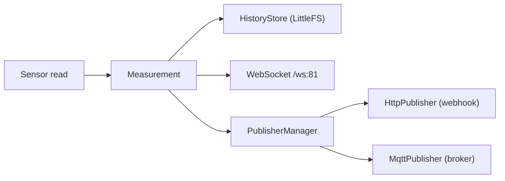

---
tags:
  - sema
  - mqtt
  - websocket
---

# MQTT y WebSocket

> **Tipo:** Referencia | **Estado:** Estable | **Firmware:** v1.60.0

Salidas en tiempo real de SEMA: **MQTT** (hacia un broker) y **WebSocket** (hacia
el dashboard local).

---

## MQTT

Publica cada medición como JSON en un topic configurable.

| Config | Default | Descripción |
|--------|---------|-------------|
| `mqtt_host` | `""` | Host del broker (vacío = deshabilitado) |
| `mqtt_port` | `1883` | Puerto |
| `mqtt_topic` | `sema/measurement` | Topic de publicación |
| `mqtt_user` | `""` | Usuario (vacío = sin auth) |
| `mqtt_pass` | `""` | Contraseña |

### Payload publicado

```json
{
  "station_id": "SEMA-001",
  "sensor_id": "EXT",
  "channel_id": "temperature",
  "measurement": "temperature",
  "value": 23.4,
  "unit": "degC",
  "quality": "VALID",
  "sequence": 123,
  "timestamp": 1720000000
}
```

### Comportamiento

- Conexión perezosa: se conecta al broker al publicar (si no está conectado).
- Sin broker configurado (`mqtt_host` vacío), el publicador queda deshabilitado.
- Con `mqtt_user` definido, usa `connect(clientId, user, pass)`.

---

## WebSocket

El dashboard local recibe mediciones en vivo por WebSocket.

| Parámetro | Valor |
|-----------|-------|
| URL | `ws://<ip>/ws` |
| Puerto | **81** |

### Mensaje de mediciones

El servidor emite el array de mediciones (mismo formato que `GET /api/v1/sensors`)
al actualizar las lecturas (`HttpServer::broadcastMeasurements`).

```json
{
  "measurements": [
    { "sensor_id": "EXT", "channel_id": "temperature", "value": 23.4, "unit": "degC", "quality": "VALID" }
  ]
}
```

---

## Resumen de flujo de publicación



Cada medición sigue el flujo **MEDIR → VALIDAR → PROCESAR → ALMACENAR → PUBLICAR**:
se guarda en el histórico y se envía a los publicadores habilitados.
