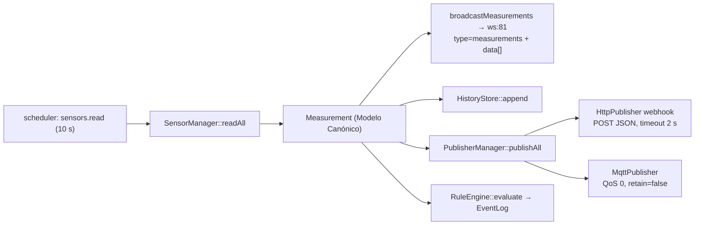

---
tags:
  - sema
  - mqtt
  - websocket
---

# MQTT y WebSocket

> **Tipo:** Referencia | **Estado:** Estable
> **Fecha:** 2026-10-08
> **Firmware:** v1.103.0

Salidas en tiempo real de SEMA: **MQTT** y el **webhook HTTP** (publicadores hacia
afuera, `src/core/publishers/`) y el **WebSocket** que sirve el propio firmware
(`src/core/web/HttpServer.cpp`). La fuente de ambas es la misma: el
**Modelo Canónico de Medición** (`include/core/Measurement.hpp`).

## 1. Dónde se dispara la publicación

Todo sale de una única tarea del `Scheduler`, registrada en
`SemaCore::setup()` (`src/core/SemaCore.cpp:188–198`) con período **10.000 ms**:

```text
sensors.read (cada 10 s)
  ├─ sensors_.readAll()
  ├─ health_.setSensorStats() + taskHeartbeat("sensors.read")
  ├─ http_.broadcastMeasurements(sensors_.measurements())   → WebSocket
  ├─ por CADA medición:
  │    ├─ history_.append(m)
  │    └─ publishers_.publishAll(m)                          → webhook → MQTT
  └─ rules_.evaluate(sensors_.measurements())                → EventLog (una vez por ciclo)
```

Consecuencias:

- La cadencia de MQTT, del webhook y del WebSocket es la **misma: 10 s**, y las
  tres salen del mismo lote de mediciones (no hay publicación por cambio).
- `publishAll()` recorre los publicadores **en orden de registro**, y ese orden es
  `webhook_` primero y `mqtt_` después (`SemaCore.cpp:167–168`), salteando los que
  tengan `enabled() == false`.
- Los publicadores reciben la medición **cruda**: conservan la unidad base del
  sensor. La conversión a unidades imperiales solo ocurre dentro de
  `GET /api/v1/sensors` (API), no acá.

## 2. Publicador MQTT

Implementación: `src/core/publishers/MqttPublisher.cpp` +
`include/core/publishers/MqttPublisher.hpp`, sobre **PubSubClient 2.8**
(`knolleary/PubSubClient@^2.8`) y un `WiFiClient` **plano**.

| Config (JSON de config) | Default | Efecto |
|-------------------------|---------|--------|
| `publishers.mqtt_host` | `""` | Host del broker. **Vacío = publicador deshabilitado** (`enabled()`) |
| `publishers.mqtt_port` | `1883` | Puerto TCP |
| `publishers.mqtt_topic` | `"sema/measurement"` | Topic de publicación |
| `publishers.mqtt_user` | `""` | Usuario. Vacío = `connect(clientId)` sin credenciales |
| `publishers.mqtt_pass` | `""` | Contraseña |

- Estas claves viven dentro del objeto **`publishers`** del JSON de config, no en
  la raíz (`ConfigManager.cpp:158–163`). Se cambian con `PUT /api/v1/config`.
- **No hay endpoint ni página** dedicada a MQTT: la web no expone estos campos.
- El `clientId` MQTT es el id del publicador: la cadena fija `"mqtt"`.
- `mqtt_host` no puede llevar esquema (`mqtt://`) ni TLS: es un socket TCP simple,
  sin `WiFiClientSecure`, así que **no hay MQTT sobre TLS (8883)**.
- Conexión **perezosa**: en cada `publish()` se checa `mqtt.connected()`; si no lo
  está, se hace `setServer()` + `connect()` ahí mismo. No hay bucle de reconexión
  propio ni backoff: si el broker está caído, cada medición (cada 10 s) intenta una
  conexión, que puede bloquear el loop hasta el timeout del cliente.
- No hay `setCallback()`, ni suscripciones, ni `setKeepAlive()`: el keepalive queda
  en el default de PubSubClient (**15 s**), versión de protocolo **MQTT 3.1.1**.
- No hay Last Will, ni `cleanSession` configurable, ni QoS configurable.

### 2.1 QoS y retain

Se usa la sobrecarga `mqtt.publish(topic, body)` (`MqttPublisher.cpp:59`), que en
PubSubClient es `publish(topic, payload, /*retained=*/false)`. Por lo tanto:

| Propiedad | Valor real |
|-----------|------------|
| QoS | **0** (PubSubClient solo implementa QoS 0) |
| Retain | **false** |
| DUP / packet id | No aplica (QoS 0) |

### 2.2 Payload publicado

Un mensaje por medición, JSON serializado con ArduinoJson en un buffer de **256 B**:

```json
{
  "station_id": "",
  "sensor_id": "EXT",
  "channel_id": "temperature",
  "measurement": "temperature",
  "value": 23.4,
  "unit": "°C",
  "quality": "VALID",
  "sequence": 123,
  "timestamp": 1760000000
}
```

| Campo | Origen | Nota |
|-------|--------|------|
| `station_id` | `Measurement::stationId` | ⚠️ **Siempre `""`** en v1.103.0: ningún componente asigna `stationId` a las mediciones (`grep stationId` solo encuentra la declaración, la API `/api/v1/status` y el `PUT /config`) |
| `sensor_id` | id lógico del sensor | p. ej. `EXT`, `INT`, `co2` |
| `channel_id` | canal lógico | habitualmente la propia magnitud |
| `measurement` | magnitud canónica | `temperature`, `humidity`, `pressure`, `co2`, `pm25`, `wind_speed`, … |
| `value` | `float` | Valor crudo del sensor (con calibración de `gain`/`offset` aplicada por el `SensorManager`) |
| `unit` | unidad base | `°C`, `%`, `hPa`, `lux`, `ppm`, `µg/m³`, `m/s`, `mm`, `V`, `W/m²` |
| `quality` | `qualityName(Quality)` | `VALID`, `INVALID`, `STALE`, `TIMEOUT`, `OUT_OF_RANGE`, `CALIBRATION_ERROR`, `COMMUNICATION_ERROR`, `SENSOR_DISCONNECTED` |
| `sequence` | contador monotónico por sensor | `0` en magnitudes derivadas y en la entrada `clock` |
| `timestamp` | `Measurement::timestamp` | Segundos de `nowEpoch()` — **época local** (UTC + offset de zona), no UTC puro. Sin NTP sincronizado cae a `millis()/1000` |

El mismo objeto JSON —campo por campo— lo emite también la medición que se guarda
en el histórico, lo que permite correlacionar MQTT con `/api/v1/history`.

## 3. Publicador HTTP (webhook)

Implementación: `src/core/publishers/HttpPublisher.cpp`, id de publicador
`"webhook"`, configurado por `publishers.webhook_url` (vacío = deshabilitado).

| Propiedad | Valor real |
|-----------|------------|
| Método | `POST` |
| `Content-Type` | `application/json` |
| Timeout | **2000 ms** (`http.setTimeout(2000)`, D-0010: corto para no bloquear) |
| Éxito | `code > 0 && code < 400` |
| Cuerpo | Idéntico al de MQTT (§2.2), misma lista de campos |
| Reintentos | ❌ Ninguno |
| Autenticación | ❌ No envía headers de auth (ni `X-API-Key`) |

Se crea sin TLS (`http.begin(url_)`), así que una URL `https://` no es soportada por
esta vía en la práctica (solo `http://`).

## 4. WebSocket

| Dato | Valor |
|------|-------|
| Quién lo sirve | `HttpServer` con `::WebSocketsServer ws_{81}` (`HttpServer.hpp:94`), librería `links2004/WebSockets@^2.4.1` |
| Puerto | **81** (fijo, hardcodeado; el WebServer HTTP usa el 80) |
| Ruta | El constructor de la librería no recibe path (`WebSocketsServer(port, origin, protocol)`): **acepta el handshake en cualquier path**. La URL canónica es `ws://<ip>:81/` |
| Arranque | `ws_.begin()` al final de `HttpServer::begin()`; `ws_.loop()` en cada `HttpServer::loop()` |
| Clientes simultáneos | Máximo **5** (`WEBSOCKETS_SERVER_CLIENT_MAX`) |
| Entrada | ❌ No hay `setCallback`: los frames entrantes se descartan (canal **solo de salida**) |
| Ping/pong | ❌ No configurado (default de la librería) |

⚠️ **La URL `ws://<ip>/ws` es incorrecta**: no existe ninguna ruta `/ws`, y el puerto
por defecto de un cliente WebSocket (80) tampoco es el correcto. Hay que usar
`ws://<ip>:81/`.

### 4.1 Mensaje emitido

`HttpServer::broadcastMeasurements()` (`HttpServer.cpp:143–164`) arma un
`DynamicJsonDocument(8192)` con **tipo de mensaje + array `data`** y lo manda con
`ws_.broadcastTXT()`:

```json
{
  "type": "measurements",
  "data": [
    { "sensor_id": "EXT", "channel_id": "temperature", "measurement": "temperature",
      "value": 23.4, "unit": "°C", "quality": "VALID", "sequence": 123 }
  ]
}
```

- Clave contenedora: **`type` + `data`** (no `measurements`).
- **No** incluye `timestamp` ni `station_id`, a diferencia de MQTT/webhook.
- El valor va **crudo** (unidad base), sin conversión imperial.
- Si `ws_.connectedClients() == 0`, el método retorna de inmediato: no se serializa
  nada (optimización explícita).
- Frecuencia: la del `scheduler` — **cada 10 s** junto con la lectura de sensores.

⚠️ **No hay consumidor en el firmware:** el dashboard embebido (`onRoot`) **no abre
ningún WebSocket** — no existe `new WebSocket(...)` en todo el repositorio. El
servidor WS queda escuchando en el puerto 81 como interfaz disponible para
clientes externos, pero nada del firmware lo usa. La página `/` se actualiza por
polling de `GET /api/v1/sensors` cada **5 s**.

## 5. Diagrama de flujo



Cada medición sigue el flujo **MEDIR → VALIDAR → PROCESAR → ALMACENAR → PUBLICAR**:
primero se difunde por WebSocket, después se guarda en el histórico y recién ahí se
publica hacia afuera.

## 6. Pendientes y limitaciones

| Tema | Estado |
|------|--------|
| `station_id` en los payloads | ⚠️ Campo presente pero siempre vacío (nunca asignado) |
| MQTT sobre TLS / autenticación por certificado | ❌ No implementado (solo TCP, usuario/contraseña) |
| QoS 1/2, retain, Last Will | ❌ No implementado (QoS 0, retain false) |
| Recepción de comandos por MQTT (suscripción) | ❌ No implementado |
| Recepción de comandos por WebSocket | ❌ No implementado (sin `setCallback`) |
| Reintentos/backoff en webhook y MQTT | ❌ No implementado |
| Publicación por evento (on-change) | ❌ No implementado: solo cadencia fija de 10 s |
| Publicadores ThingSpeak / Windy | ❌ No implementados: la interfaz `Publisher` existe (`include/core/publishers/Publisher.hpp`), pero en v1.103.0 solo se registran `webhook` y `mqtt` |
| Endpoint/página para configurar MQTT | ❌ No existe: solo `PUT /api/v1/config` con el bloque `publishers` |

---

## Ver también

- [API-REST](API-REST.md) · [Configuracion](Configuracion.md) · [Referencia-configuracion](Referencia-configuracion.md)
- [Conectividad-y-red](Conectividad-y-red.md) · [Comunicaciones-remotas](Comunicaciones-remotas.md)
- [Identidad-y-estados](Identidad-y-estados.md) · [Arquitectura](Arquitectura.md) · [Diagramas](Diagramas.md)
